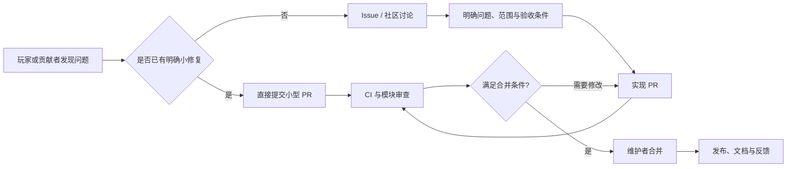

# 组织协作与建议

:::info[开放协作]
CCB 欢迎玩家、译者、美术作者、MOD 作者和开发者参与。是否拥有组织成员身份，不影响你提交 Issue、参与讨论、翻译或通过 Fork 发起 PR。
:::

本页描述的是**职责和决策流程**，不是固定头衔名单。人员会变化，仓库权限与自动审查配置才是当前执行依据。

## 公开仓库分工

| 仓库 | 负责内容 | 主要贡献方式 |
|---|---|---|
| [Cataclysm-Cleanwater-Bomb](https://github.com/CrimsonCrossBunker/Cataclysm-Cleanwater-Bomb) | 游戏源码、JSON、内置 MOD、构建、发布、Issue 与 PR | Issue、Fork、PR、代码审查 |
| [CrimsonCrossBunker.github.io](https://github.com/CrimsonCrossBunker/CrimsonCrossBunker.github.io) | 官方网站、教程、路线说明和项目动态 | 文档 Issue、PR、链接与构建检查 |
| [CCB_UNDEAD_PEOPLE](https://github.com/CrimsonCrossBunker/CCB_UNDEAD_PEOPLE) | CCB 使用的 UNDEAD_PEOPLE 贴图源、compose 工具和发布包 | 素材认领、工作表、贴图 PR |
| [Catapult](https://github.com/CrimsonCrossBunker/Catapult) | 跨平台启动器与内容管理器 | 按该仓库自己的贡献规范提交 |
| [CCB Transifex](https://app.transifex.com/Cataclysm-Cleanwater-Bomb/cataclysm-cleanwater-bomb/dashboard/) | 游戏在线翻译与语言团队协作 | 翻译、校对、术语讨论 |

不要把游戏 Bug 提到网站仓库，也不要通过游戏 PR 直接提交普通在线译文。跨仓库改动应拆成可独立审查的提交，并互相链接。

## 协作角色

### 社区参与者

游玩、复现、提出建议、补充现实资料和验证测试版本。高质量复现与反馈本身就是贡献，不要求会编程。

### 贡献者

通过 PR 提交代码、JSON、文档、构建、贴图或工具改动。贡献者对改动范围、作者与许可、测试记录和审查响应负责。

### 译者与校对者

在 Transifex 语言团队中翻译、统一术语、保护占位符和检查游戏内显示。翻译协作平台与 GitHub 代码审查分开，但字符串上下文问题可回到游戏仓库修复。

### 模组维护者 / 模块审查者

负责特定内置 MOD 或目录的设计一致性和兼容性，审查进入该范围的 PR，并响应相关 Bug。当前路径审查分配以游戏仓库的 [`.github/reviewers.yml`](https://github.com/CrimsonCrossBunker/Cataclysm-Cleanwater-Bomb/blob/master/.github/reviewers.yml) 为准。

### 仓库维护者

负责分流 Issue、审查跨模块影响、维护 CI 和标签、决定 PR 是否达到合并条件。维护者可以要求缩小范围、补测试或保留兼容性，但应在公开讨论中说明依据。

### 组织与发布管理员

维护仓库权限、密钥、分支保护、发布和跨仓库基础设施。管理员权限用于执行已经形成的项目决策，不代替技术审查和社区讨论。

## 一项改动如何形成决定

大型方向不是“聊天里说过就算决定”。应把问题、方案、替代方案和验收条件沉淀到公开 Issue 或 PR，方便后来者理解背景并继续维护。

## 建议应该发到哪里

| 建议类型 | 入口 | 最少提供 |
|---|---|---|
| 游戏机制、内容和平衡 | [功能建议模板](https://github.com/CrimsonCrossBunker/Cataclysm-Cleanwater-Bomb/issues/new?template=feature_request.yaml) | 当前问题、期望方案、替代方案、依据 |
| Bug 与兼容问题 | [Bug 模板](https://github.com/CrimsonCrossBunker/Cataclysm-Cleanwater-Bomb/issues/new?template=bug_report.yaml) | 版本、存档、复现步骤、日志 |
| 翻译与术语 | [Transifex](https://app.transifex.com/Cataclysm-Cleanwater-Bomb/cataclysm-cleanwater-bomb/dashboard/)与翻译群 | 词条、上下文、建议译法与原因 |
| 网站教程 | [网站 Issues](https://github.com/CrimsonCrossBunker/CrimsonCrossBunker.github.io/issues) | 页面链接、过时内容、当前依据 |
| 贴图 | [贴图仓库](https://github.com/CrimsonCrossBunker/CCB_UNDEAD_PEOPLE)与贴图群 | 游戏 ID、参考、尺寸与素材来源 |
| 尚未成形的跨模块想法 | [社区](/community) | 想解决的问题、受影响人群和初步范围 |

## 一份容易被采纳的建议

1. **先说问题**：谁在什么场景遇到什么困难。
2. **提供证据**：存档、日志、代码位置、现实资料、对比数据或玩家流程。
3. **给出边界**：本次必须完成什么，哪些内容明确留到以后。
4. **比较替代方案**：包括“不改代码”的流程或数据方案。
5. **定义验收**：用可观察行为判断是否完成。
6. **愿意跟进**：回答问题、测试候选版本或协助实现。

“我喜欢/不喜欢”可以作为讨论起点，但不能单独决定机制。CCB 欢迎不同意见；讨论应针对行为、数据和维护成本，不针对个人。

## 透明度与维护原则

- 重要技术结论尽量留在 Issue、PR 或仓库文档，不只存在于群聊。
- 有利益或作者关系时主动说明，例如自己是目标 MOD 的维护者。
- 合并权限不等于对所有模块拥有最终专业判断，优先邀请对应维护者审查。
- 紧急修复可以先恢复可用性，但要补 Issue、测试或事后说明。
- 规则与实际自动化不一致时，先记录差异，再更新文档、模板或工作流。
- 欢迎提出组织流程建议；请具体指出当前阻塞、受影响角色和希望改善的结果。

## 加入与成长

从一个可验证的小任务开始。持续贡献者可以逐步承担 Issue 分流、测试、翻译校对、MOD 维护或代码审查。权限应跟随实际维护责任，而不是成为参与贡献的前置条件。

下一步可从[贡献路线](./intro)、[提交 Issue](./issues)或[提交 PR](./pull-requests)开始。
